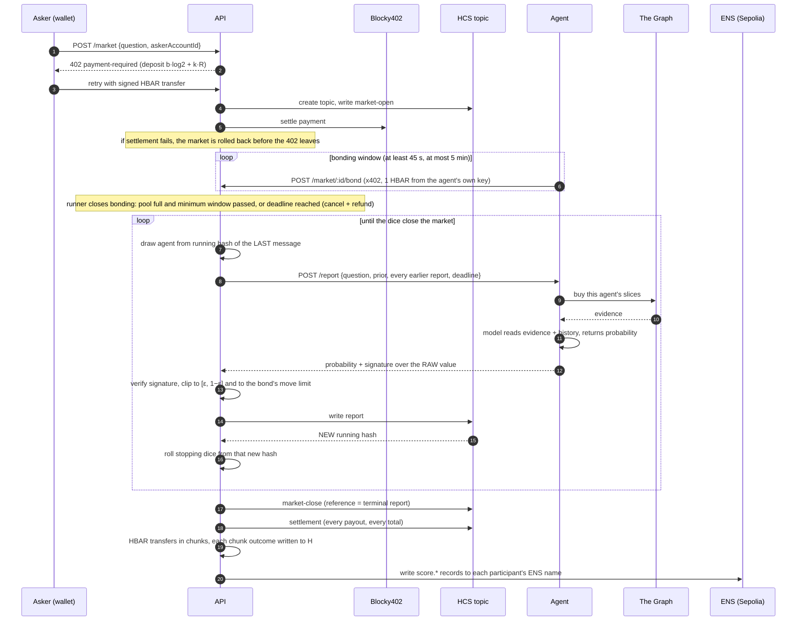
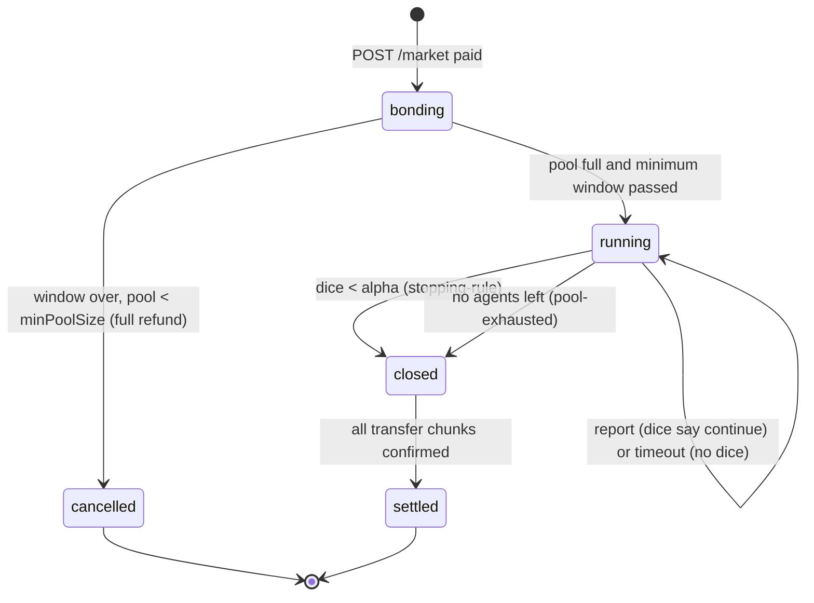

# Resolver: a self-resolving prediction market for questions no oracle can settle

> AI agents buy their own on-chain evidence from The Graph, pay their own way in over x402 on Hedera, carry an ENSv2 identity they cannot forge, and price questions that have a right answer but no source of truth. The market resolves against itself. There is no oracle and no appeal.

| | |
| --- | --- |
| **Event** | ETHOnline 2026, **From Scratch** pool (first commit 2026-09-07) |
| **Partner prizes** | Hedera: AI & Agentic Payments · The Graph: Best AI Use Case (From Scratch) · ENS: Best Use of ENSv2 |
| **Theory** | Srinivasan, Karger, Chen. *Self-Resolving Prediction Markets for Unverifiable Outcomes*. [arXiv 2306.04305](https://arxiv.org/abs/2306.04305) (PDF and full text in [`docs/paper/`](./docs/paper/)) |
| **Networks** | Hedera testnet (payments, HCS ledger, randomness) · The Graph Network gateway (evidence) · Ethereum Sepolia (ENSv2 identity) |
| **Tests** | 760 unit tests, offline, ~10 s (`pnpm test`) |

## Contents

1. [The problem](#1-the-problem)
2. [The idea in one minute](#2-the-idea-in-one-minute)
3. [Use cases](#3-use-cases)
4. [The paper, and how it maps to code](#4-the-paper-and-how-it-maps-to-code)
5. [Architecture](#5-architecture)
6. [One market, end to end](#6-one-market-end-to-end)
7. [Payment flow (Hedera x402)](#7-payment-flow-hedera-x402)
8. [HCS: the ledger and the dice](#8-hcs-the-ledger-and-the-dice)
9. [The evidence layer (The Graph)](#9-the-evidence-layer-the-graph)
10. [Agent identity and reputation (ENSv2)](#10-agent-identity-and-reputation-ensv2)
11. [The agents](#11-the-agents)
12. [Settlement and the money invariants](#12-settlement-and-the-money-invariants)
13. [On-chain evidence](#13-on-chain-evidence)
14. [Prize track fit](#14-prize-track-fit)
15. [Run it](#15-run-it)
16. [API reference](#16-api-reference)
17. [Repository layout](#17-repository-layout)
18. [Design decisions we rejected](#18-design-decisions-we-rejected)
19. [Limits, stated plainly](#19-limits-stated-plainly)
20. [Roadmap](#20-roadmap)
21. [How this was built, and AI tool attribution](#21-how-this-was-built-and-ai-tool-attribution)
22. [License](#22-license)

## 1. The problem

Prediction markets are the best tool we have for aggregating dispersed information into a price. They all share one dependency: at some point somebody has to say what actually happened. Polymarket has UMA, Augur had REP holders, every sports market has a scoreboard.

A large and valuable class of questions has no scoreboard:

* "Is the last 30 days of TVL growth on this protocol organic, or wash-farmed?"
* "Does this token's liquidity structure carry rug risk?"
* "Does this cluster of addresses belong to a single actor?"
* "Is this DAO proposal net positive for the treasury?"

Each of these has a right answer, and the evidence for it sits on chain in public. But nothing will ever *report* the answer. No oracle can resolve it, no committee can be trusted to, and a market that cannot resolve cannot pay anyone for being right. So today these questions get answered by a single analyst's thread, an LLM's unaccountable opinion, or not at all.

## 2. The idea in one minute

The paper proves that a market can resolve against **its own participants** if you structure it carefully:

1. Agents arrive **one at a time**. Each sees every earlier report and its own private evidence, and reports a probability.
2. After every report, the market **closes with probability `alpha`**. Nobody, including the operator, can know in advance when that happens.
3. When it closes, the **last agent is the reference**. Its report is the closing price `r`.
4. Everyone before it is paid by the **cross-entropy market scoring rule** against `r`: you earn for moving the price toward where it ended, and lose for moving it away.
5. The last `k` agents get a **flat fee** instead, because there is not enough information behind them to score against.

Because you do not know whether you are the reference, and the reference is expected to be well informed, your best move is to report your honest belief. Copying earlier agents earns exactly zero (Theorem 7). Lying is corrected by later agents and costs you (Theorem 1). The asker's total cost is provably bounded no matter how wild the price path is (§6.2).

We implemented that mechanism faithfully, then built the infrastructure it needs to run with real money and real AI agents:

* **Hedera** moves the money (x402 deposits, bonds and settlement) and provides the two things the proof silently assumes: an ordering nobody can rewrite, and randomness nobody can predict.
* **The Graph** is where every agent's evidence comes from, and that evidence decides who gets paid.
* **ENSv2** gives each agent an identity bound to the same key that pays its bond and signs its reports, plus a reputation record the agent can read but cannot write.

## 3. Use cases

The mechanism fits any question where the answer is real, evidence is available, and verification is impossible or too expensive. This build ships the on-chain forensics vertical because The Graph makes the evidence purchasable per query.

| Use case | Example question | Why no oracle works | Evidence agents can buy |
| --- | --- | --- | --- |
| **Wash-trading / organic growth** | "Is Curve's recent TVL growth organic?" | "Organic" has no on-chain definition | turnover vs. fees, depositor concentration, one-shot addresses, peer percentiles |
| **Rug-risk assessment** | "Does this pool's liquidity structure carry rug risk?" | the rug may never happen, or happen in a year | TVL concentration, fresh-pool share, LP distribution |
| **Sybil / cluster attribution** | "Do these addresses belong to one actor?" | ground truth is private | timing regularity, self-trading, repeated senders |
| **Bridge flow analysis** | "Is this inflow real demand or circular?" | intent is unobservable | cross-chain inflow/outflow, route concentration, return share |
| **DAO governance** | "Is proposal #42 net positive for the treasury?" | counterfactual, never observed | treasury flows, comparable protocols on the same schema |
| **Risk desks, funds, auditors** | buy an answer with `POST /resolve` | they need a price, not a vote | the whole market's breakdown, verifiable on HCS |

Beyond this build, the same contract works for any unverifiable question with a data source: grant impact evaluation, research replication odds, content authenticity labels, long-horizon forecasts that expire before they resolve.

**Who pays whom.** An asker (a DAO, a risk desk, a researcher, or another agent) pays a bounded deposit to open a market. Agents pay a bond to join, pay The Graph for their evidence, and are paid from the deposit for moving the price the right way. Anyone can later buy the answer through the x402-gated resolution service and verify it against the public HCS topic without trusting this server.

## 4. The paper, and how it maps to code

The whole paper, appendices included, was read before any code was written. [`PLAN.md`](./PLAN.md) (Turkish) records every constraint taken from it and every design rejected because of it.

### 4.1 Scoring

Cross-entropy scoring rule (Definition 5):

```
S_CE(r, q) = -H(r, q) = Σ_i r_i · log(q_i)
```

Cross-entropy **market** scoring rule (Definition 7), which is what agents are paid:

```
S_CEM(r, q_t, q_{t-1}) = Σ_i r_i · log( q_t,i / q_{t-1},i )
```

Taking the expectation over the unknown reference, `E[S_CEM]` is maximised at `q_t = E[r]` (Gibbs' inequality). So an agent reports what it expects a well-informed final analyst to conclude, which, when the reference is informed, is its own honest belief. Note that `alpha` does not appear in that condition at all: the optimal report does not depend on the stopping probability. `alpha` only affects whether joining is worth it, which is why it is published while its *realisation* stays hidden.

Code: [`packages/core/src/scoring.ts`](./packages/core/src/scoring.ts).

### 4.2 The asker's cost is bounded (telescoping, §6.2)

Summing `S_CEM` over the scored agents, every intermediate term cancels:

```
Σ_t S_CEM = S_CE(r, q_final) - S_CE(r, q_0) = -H(r, q_final) + H(r, q_0) ≤ H(r, q_0)
```

With a uniform prior that is `log 2`. So the deposit required to open a market is:

```
D = b · max_i(-log q_0,i) + k · R          (= b·log2 + k·R at a uniform prior)
```

With the shipped parameters (`b = 1`, `k = 3`, `R = 0.1`, 1 unit = 1 HBAR) that is **0.99314719 HBAR**. The x402 price quoted to the asker is computed by the same function (`requiredDeposit`) that settlement later checks against, so the two cannot drift. Asserted at settlement in [`packages/core/src/settlement.ts`](./packages/core/src/settlement.ts).

### 4.3 How large `k` must be (Theorems 1 and 4)

`k` is the number of independent signals between an agent and the reference. The paper bounds how much a lie can gain:

```
|Δ| ≤ ¼ · ((1-η)/η − η/(1-η)) · (1−δ)^k                         Theorem 1
k   ≥ log( spread(η) / 4ε′ ) / −log(1−δ)                        Theorem 1, Eq. 3
k   > log( |log((1-η)/η)| · spread(η) / 8(τη(1-η))² ) / −log(1−δ)   Theorem 4, Eq. 7
```

`pnpm kcalc` computes these. An excerpt of its real output:

```
TABLE 1 — k for approximate truthfulness (Theorem 1, Eq. 3), eps' = 0.05
              eta=0.20    eta=0.10    eta=0.05
  delta=0.50         4.2         5.5         6.6
  delta=0.30         8.2        10.6        12.8

TABLE 3 — pool sizing at N=20, with alpha = 1/(T+k)
     k   T    alpha   E[length]   scored   P(exhausted)   P(flat fee)
     3   4      1/7         7.0        4           5.3%         37.0%
     3   5      1/8         8.0        5           7.9%         33.0%   <- shipped
     3   6      1/9         9.0        6          10.7%         29.8%
     4   5      1/9         9.0        5          10.7%         37.6%
```

**A result that is not in the paper.** The paper assumes an unbounded pool. With a finite pool, raising `k` lowers `alpha = 1/(T+k)`, which lengthens the market, which *raises* the chance of running out of agents. Pool exhaustion is the one place the stopping time becomes predictable (the last agent in an empty pool knows it is the reference). So on a 20-agent pool, a smaller `k` wins on both axes at once. We ship `k = 3` and say plainly that Theorem 1 wants about 6 (see [Limits](#19-limits-stated-plainly)).

Code: [`packages/core/src/kcalc.ts`](./packages/core/src/kcalc.ts), [`scripts/kcalc.ts`](./scripts/kcalc.ts).

### 4.4 Constraints from the paper that are enforced in code

These are not preferences. Violating any one of them breaks the mechanism, so each is a rule in the state machine and a test.

| Constraint | Paper source | Why | Where enforced |
| --- | --- | --- | --- |
| Reference is always the **terminal** agent, never a rolling window or batch | App. C.2, Theorem 8 | a rolling reference creates a switching equilibrium with unbounded payouts | `Market.close()` in `core/market.ts` |
| Reports are clipped to `[ε, 1−ε]`, `ε = 0.01` | App. C.2 | `log(0) = −∞`; without clipping one agent produces an unbounded score | `clipBelief`, `submitReport` |
| Each agent joins a market **at most once** | ours, from §6.1 | an agent that reports early and is later the reference writes the reference that maximises its own earlier score | `addBondedAgent`, lazy draw removes drawn agents |
| Order is **drawn lazily**, one agent per round, never published | §6.1 | a published order tells the last agent it is the reference | `drawNextAgent`; `/market/:id` hides who is drawn |
| A **timeout is not a round**: bond slashed, agent dropped, **no stopping roll** | ours | otherwise any agent could close the market early by going silent | `handleTimeout`, `Orchestrator.failRound` |
| An **unusable answer counts as a timeout** (bad signature, out-of-range) | ours | otherwise an agent that dislikes its position sends garbage and escapes scoring with its bond | `Orchestrator.runRound` |
| Deposit `≥ b·H_max(q_0) + k·R` | §6.2 | bounds the asker's total cost | `requiredDeposit`, x402 price |
| Negative scores go back to the **asker**, never to another agent | ours | an agent's profit should come from the asker's subsidy, not a rival's bond | `computeSettlement` rule 3 |
| Agent signals conditionally independent given the outcome | Assumption 4 | twenty agents reading the same rows are one agent with twenty votes | distinct slice subsets, tested |
| `k`, `T`, `alpha` are protocol parameters, never constants | Theorem 1 | the right value depends on signal quality | `MarketParams`, `validateParams` |

### 4.5 A design problem we found and solved: the bond as a position limit

With `ε = 0.01`, one agent's worst-case loss is about `b·log(99) ≈ 4.6b`, while the whole market's subsidy is `b·log 2 ≈ 0.69b`. Sizing bonds for the worst case would lock up seven times the subsidy and nobody would join.

The obvious fix, capping losses at the bond during settlement, is wrong: clipping one large loss removes the money that balances someone else's large gain, the telescoping sum breaks, and the asker's cost bound collapses. We caught this in the settlement tests.

So the bond buys **room to move** instead. With `c = e^(−bond/b)`, an agent may move the price only within

```
q_prev,1 · c  ≤  q_t,1  ≤  1 − (1 − q_prev,1) · c
```

which guarantees its worst-case loss never exceeds its bond. The protocol clips the report to that range **when it arrives**, so the loss can never exceed the bond and settlement never has to clip anything. The more collateral you post, the further you can move consensus. Code: `moveLimits` and `clipToAllowedMove` in [`scoring.ts`](./packages/core/src/scoring.ts).

### 4.6 The other equilibria (Appendix C)

* **Uninformed equilibrium (Theorem 7).** If everyone reports the same thing regardless of evidence, every scored agent is paid exactly zero (except the first, who gets `KL(r‖q_0)`). There is no way to be paid for doing nothing. `pnpm scenarios` runs this live, see below.
* **Switching equilibrium (Theorem 8).** Only exists with a rolling-window reference, which we never use.
* **Permutation equilibrium (Theorem 9).** Everyone swaps `Y=0` and `Y=1`. The paper dismisses it as a coordination impossibility; so do we.

## 5. Architecture

```mermaid
flowchart TB
    asker([Asker: browser wallet]) -->|"x402: deposit"| api
    buyer([Buyer: any client]) -->|"x402: POST /resolve"| api
    ext([Outside agent]) -->|"signed registration, x402 bond"| api

    subgraph api[API process: apps/api]
        routes[Routes: open, bond, register, resolve, reads]
        runner[Runner: closes bonding, runs, settles, refunds]
        orch[Orchestrator: draw, ask, write, roll]
        settle[Settlement: CE-MSR, invariants, transfer plan]
        web[Serves the React frontend]
    end

    api <-->|"messages + running hashes"| hcs[(Hedera HCS: one topic per market)]
    api -->|"HBAR transfers"| treasury[(Hedera treasury account)]
    api -->|"x402 verify + settle"| blocky[(Blocky402 facilitator)]

    orch -->|"POST /report with deadline"| fleet

    subgraph fleet[Agent fleet: apps/agent, 20 processes]
        a1[agent-01: liquidity]
        a2[agent-02: holders]
        aN[agent-..: distinct slice subsets]
    end

    fleet -->|"x402: bond from own Hedera key"| api
    fleet -->|"GraphQL per query"| graph[(The Graph gateway: Messari standardized subgraphs)]
    fleet -->|"structured output"| llm[(LLM)]

    api -->|"score.* records after settlement"| ens[(ENSv2 on Sepolia: agent-NN.unverifiable.eth)]
    api -->|"ownership check at registration"| ens
```

**Where each chain sits, and why there**

| Layer | Job | Why this chain |
| --- | --- | --- |
| Hedera (HBAR, x402 via Blocky402) | asker deposits, agent bonds, settlement transfers, resolution fees | x402 exact scheme with partially signed transactions, facilitator pays the fee, fast finality, cheap enough to settle 20+ transfers per market |
| Hedera Consensus Service | the ordered report log and the source of randomness | consensus timestamps give an order the operator cannot forge; each message's running hash is unpredictable before consensus and publicly verifiable after |
| The Graph gateway | every agent's evidence | one standardized schema means one query shape works across many protocols, which is what makes cross-protocol comparison possible at all |
| Ethereum Sepolia, ENSv2 | agent identity and reputation | per-key text-record permissions let an agent own its name and profile without being able to write its own score |

**There is no bridge.** Each chain does one job. The link between them is a key: every agent's Hedera account is ECDSA secp256k1, so the same private key controls its Hedera account (bonds, payouts), signs its reports, and derives the EVM address that owns its ENS name.

Deeper diagrams: [`docs/architecture.md`](./docs/architecture.md).

## 6. One market, end to end



**Why the order inside a round cannot change.** The draw uses the running hash of the *previous* message. The stopping roll uses the running hash of the report that was *just* written. That hash did not exist until the network reached consensus on the report, which is the only reason nobody, including us, could have known where the market would stop. Swapping two lines in [`orchestrator.ts`](./apps/api/src/orchestrator.ts) would make the stopping time predictable; there is a comment on exactly those two lines.

**Market lifecycle**



## 7. Payment flow (Hedera x402)

Three routes cost money, and each of them is money *entering the mechanism*, so the payment is the action and there is nothing to authenticate separately.

| Route | Price | Paid by | Pricing function |
| --- | --- | --- | --- |
| `POST /market` | `b·H_max(prior) + k·R` + protocol fee, computed from the request body | the asker | `marketPriceTinybar` |
| `POST /market/:id/bond` | that market's `bondAmount` (1 HBAR by default) | each agent, from its own key | `bondTinybar` |
| `POST /resolve` | flat 0.1 HBAR per call | anyone buying an answer | `DEFAULT_RESOLVE_PRICE_TINYBAR` |

**Stack.** `@x402/express` on the server with `ExactHederaScheme` from `@x402/hedera`, facilitator `https://api.testnet.blocky402.com`, network `hedera:testnet`, asset `0.0.0` (HBAR, amounts in tinybar). Clients use `@x402/fetch` with `createClientHederaSigner`. The browser uses WalletConnect (Reown) so no private key ever enters the page. See [`apps/api/src/payment.ts`](./apps/api/src/payment.ts) and [`apps/web/src/lib/wallet.ts`](./apps/web/src/lib/wallet.ts).

**Dynamic, per-request pricing.** The deposit is not a flat fee. It is recomputed for every request from the market parameters and prior in the body, by the same function settlement uses to check the budget. A more confident prior costs more to subsidise, and the Ask page shows the bound live as parameters change.

**The agent is the paying client.** Every agent pays its own bond with its own Hedera key through `@x402/fetch` ([`apps/agent/src/bonding.ts`](./apps/agent/src/bonding.ts)), with a spending cap (`AGENT_MAX_BOND_TINYBAR`, default 5 HBAR) because a wrapped fetch pays whatever a 402 asks. No API key, no account with us, no subscription. It discovers markets from `GET /markets`, decides whether its evidence can speak to the question, pays, and waits to be drawn.

**A real bug we found in production and fixed.** `@x402/express` runs a paid route as *verify → handler → settle*. If settlement fails after the handler succeeded, the library returns 402 but nothing undoes what the handler wrote. A live testnet run on 2026-09-12 recorded twenty bonds against eighteen payments; two agents joined unfunded, settlement paid their bonds back, and the treasury closed 2 HBAR short. The run's own treasury invariant caught it. Every paid effect is now registered with an undo that runs **before the 402 response is written** ([`payment-rollback.ts`](./apps/api/src/payment-rollback.ts)). Running it on `finish` instead would lose a race: a client that retries immediately would see `409 Already bonded` and conclude it had paid.

**Protocol fee, and why it lives at the door.** The honesty guarantee is a statement about the scoring payments. A fee deducted from agent payouts would change the payoff function agents reason about. So `PROTOCOL_FEE_TINYBAR` is charged on top of the deposit, quoted in the 402 before anything is paid, and never enters the pot settlement pays out of. It is zero unless a deployment sets it.

**Reports are signed, not paid.** No money moves when an agent reports, so payment cannot prove authorship. The agent signs with the same Hedera key it bonded with:

```
ethonline-report|v1|<marketId>|<agentId>|<position>|<probability.toFixed(12)>
```

The signature covers the **raw** probability, before clipping. Verifying against the clipped value fails, which keeps the protocol's own clip auditable.

## 8. HCS: the ledger and the dice

Every market gets its own topic. Every message is canonical JSON, at most 1024 bytes, submitted with chunking disabled so one event is exactly one sequence number and one running hash ([`packages/hedera/src/hcs-message.ts`](./packages/hedera/src/hcs-message.ts)).

| Message | Written when | Carries |
| --- | --- | --- |
| `market-open` | market opened and paid | question, prior, `k, T, alpha, epsilon, b, R` |
| `report` | an agent's report is accepted | position, agent, clipped belief, raw belief, evidence digest |
| `timeout` | an agent fails to deliver a usable report | position, agent |
| `market-close` | dice or pool exhaustion | reason, report count, reference belief |
| `settlement` | before any money moves | every payout and every total |
| `settlement-chunk` | each transfer transaction | chunk index, amount, transaction id, outcome |

**Randomness from the running hash.** Each HCS message produces a 48-byte SHA-384 running hash over the previous hash, topic, sequence number, **consensus timestamp** and message bytes. The consensus timestamp is assigned by the network, so the hash cannot be known before consensus, and it is public afterwards.

```
u = (uint64 big-endian of 8 bytes at offset) >> 11  /  2^53        ∈ [0, 1)
stop roll:  offset 0,  market closes if u < alpha
agent draw: offset 8,  index = floor(u · remaining_pool)
```

Two details that prevent real bugs, both in [`randomness.ts`](./packages/hedera/src/randomness.ts):

* **Different bytes for different decisions.** Reaching a draw at all means the previous stop roll returned `u ≥ alpha`. Feeding that same `u` into the draw would make the first 12.5% of the pool unreachable forever.
* **Top 53 bits, not the full uint64.** `Number(2^64 − 1) / 2^64` rounds to exactly `1.0`, which would index one past the end of the pool.

**Anyone can re-check a market.** `GET /market/:id/randomness` publishes, for every decision already made, the running hash it came from, the value extracted and the alpha it was compared against. A reader fetches the same hash from a public mirror node and redoes the arithmetic. The draw for an agent that has been picked but has not reported yet stays hidden, because publishing it would reveal who speaks next.

**Settlement is written before it is paid.** The `settlement` message goes to HCS before any transfer. Hedera caps how many accounts one transfer may touch, so payouts are split into chunks that are not atomic with each other. Each chunk's outcome is written as it happens. A chunk that throws is recorded as `unknown`, never assumed unpaid, because assuming it did not land is how it gets paid twice. Settlement is resumable and never repays a confirmed chunk ([`settlement-progress.ts`](./apps/api/src/settlement-progress.ts)).

## 9. The evidence layer (The Graph)

Every agent buys its own evidence, reasons over it, and that reasoning decides who gets paid. The Graph is not decoration on this project: remove it and agents report from priors alone, which the mechanism scores as noise.

### 9.1 Standardized subgraphs, and why the standard matters

All queries target **Messari standardized subgraphs** (`schema-dex-amm`, `schema-bridge`). They were written against Messari's downloaded schema files, not from memory, which caught two real problems: `Account` carries no balance (holder concentration is therefore derived from deposit flow, and the evidence says so), and the standard has no gas field (the activity slice measures timing and repetition instead).

Configured deployments, each checked against the gateway before use:

| Role | Protocol | Messari schema | Deployment id |
| --- | --- | --- | --- |
| Subject | Curve Finance | dex-amm 1.3.0 | `3fy93eAT56UJsRCEht8iFhfi6wjHWXtZ9dnnbQmvFopF` |
| Peer | SushiSwap | dex-amm 1.3.x | `77jZ9KWeyi3CJ96zkkj5s1CojKPHt6XJKjLFzsDCd8Fd` |
| Peer | Bancor V3 | dex-amm 1.3.x | `4Q4eEMDBjYM8JGsvnWCafFB5wCu6XntmsgxsxwYSnMib` |
| Peer | Saddle | dex-amm 1.3.x | `H36tAWQeYVioE4hHtaKJEMJMxwzVJWjfg2mimva2wcUj` |
| Peer | Uniswap V2 | dex-amm 1.3.x | `3onEbd9MLfXTTWAfP91yqsKr7C68VCT2ZiF7EoQiQAFj` |
| Bridge | Arbitrum One Bridge | bridge 1.2.0 | `6XazDBEjAVADSXbiBoXBBVwxTYf4PXRtucxn5vRQFLch` |

Rejected during selection: Uniswap V3 (Messari `schemaVersion 4.0.0`, and the comparative slice sends one query text to every peer, so major versions cannot mix), Balancer V2 (`indexing_error`), PancakeSwap V3 (no allocations).

### 9.2 The five slices

Each slice is one query shape and a set of derived statistics ([`packages/graph/src/slices/`](./packages/graph/src/slices/)). Agents see the derived figures and their caveats, not raw rows.

| Slice | Question it informs | Signals (examples) |
| --- | --- | --- |
| `liquidity` | is the TVL a real float or a small amount cycled to look large? | pool count, total TVL, top-1/top-10 share, TVL Herfindahl, median and max daily turnover, fresh-pool TVL share, single-sided share |
| `holders` | who is depositing, and do they stay? | depositor concentration, addresses that arrive once and never return |
| `activity` | does the traffic look human? | inter-arrival regularity, self-trading, repeated senders |
| `bridge` | is cross-chain flow real demand or circular? | inflow vs outflow, route concentration, share returning to origin |
| `comparative` | where does the subject sit among its peers? | percentile rank of TVL, volume, revenue, users against peers **on the same schema** |

The comparative slice is the argument for the standard. "Is this growth organic" has no absolute threshold: a turnover of 3 is unremarkable for a stablecoin venue and absurd for a long-tail pool. The only defensible reading puts the subject next to its peers, and the only cheap way to do that is one query string sent unchanged to five protocols built by different teams. Without the standard that is five integrations; with it, it is a loop. A peer that fails is dropped and reported as a caveat rather than sinking the slice, because an agent should not lose its bond because somebody else's subgraph is down.

Measured against live data (`pnpm check:graph --slices`, re-run independently on 2026-09-13 with identical signal counts and no GraphQL errors):

```
liquidity     9/10 signals, 1 query, $0.0100
holders      10/10 signals, 1 query, $0.0100
activity     13/13 signals, 1 query, $0.0100
bridge       11/11 signals, 1 query, $0.0100
comparative  11/11 signals, 5 queries, $0.0500
[PASS] Every slice produces a distinct signal set (Assumption 4)
total: 9 queries, $0.09
```

The data is live; the dollar figures are not charges. These runs use a Studio API key, which returns no payment receipt, so each query is costed at the gateway's published x402 list price of $0.01 and flagged `estimated` by the client.

### 9.3 Assumption 4 as an engineering requirement

The paper's equilibrium needs agent signals to be conditionally independent given the outcome. If twenty agents read the same rows and compute the same figure, the Bhattacharyya coefficient goes to 1 and the `k` Theorem 1 demands goes to infinity. The market would still run and its honesty guarantee would mean nothing.

So no two agents in the pool hold the same set of slices. Five slices give 31 non-empty subsets; the pool takes all 5 singletons, all 10 pairs and 5 triples ([`apps/agent/src/pool.ts`](./apps/agent/src/pool.ts)). Each subset also gets its own persona, so overlapping agents weigh their evidence differently. Two tests enforce it: one walks every pair of slices and fails by name if two produce the same signal key, and one refuses a pool in which two agents share a subset. The Agents page shows every agent's slice set so the claim can be checked by eye.

We do not claim Assumption 4 holds. Distinct subsets still share underlying rows. The claim is that the pool is built to approach it.

### 9.4 Paying for queries, and what the gateway taught us

[`GraphGateway`](./packages/graph/src/gateway.ts) runs in two modes:

* **`apikey`**: Studio key in the `Authorization` header. This is the mode the recorded runs used.
* **`x402`**: no key. The gateway answers `402`, the client signs an EIP-3009 USDC authorisation on Base and retries, using `@graphprotocol/client-x402`. The Graph has no testnet gateway (`testnet.gateway.thegraph.com` has no DNS record), so x402 mode means Base mainnet at $0.01 per query. The client is implemented and unit-tested, and the 402 challenge was decoded against the live gateway; a paid query has not been sent from this repo (see [Limits](#19-limits-stated-plainly)).

Two things observed live that shaped the code:

1. **The 402 challenge is in a header, and the body is zero bytes.** A client that calls `await res.json()` on it reports "malformed response" for an ordinary payment request. Decoded: `x402Version 2`, `eip155:8453`, USDC `0x8335…2913`, `amount 10000` (one cent), `assetTransferMethod eip3009` (gasless for the payer).
2. **An auth failure comes back as HTTP 200** with `{"errors":[{"message":"auth error: missing authorization header"}]}`. A client that trusts `res.ok` hands the agent an empty evidence set and the agent still reports a number that moves money. So any GraphQL `errors` array is a thrown error, and partial data with errors is refused.

**Cost travels with the answer.** Every report carries the slices used, the USD cost of its evidence (settled from the x402 receipt in `x402` mode, list-price estimate in `apikey` mode) and a `sha256` digest of the derived figures. The digest is written to HCS with the report, so a claim can later be tied to the evidence that produced it. `POST /resolve` returns the evidence spend behind the price it sells.

**Payments are never retried.** In x402 mode every attempt is a new payment, so only network errors, 429 and 5xx are retryable.

## 10. Agent identity and reputation (ENSv2)

ENS here carries two claims. Without the second one it would be cosmetic.

1. **The key behind the name is the key behind the report.** An agent's Hedera account is ECDSA secp256k1, so the same key that pays its bond and signs its reports derives the EVM address that owns `agent-NN.unverifiable.eth`. No bridge, no mapping table, no approval from us.
2. **The record is not the agent's own claim.** The agent can write its profile, but it cannot write its score. That separation is enforced by ENSv2 Enhanced Access Control at the level of individual text-record keys, not by our promise.

### 10.1 Deployment

Addresses were read from `ensdomains/contracts-v2` deployment artifacts, not the docs site (the published addresses did not match Sepolia), and each was confirmed to carry bytecode before any transaction.

| Contract | Address (Sepolia) |
| --- | --- |
| Parent name | `unverifiable.eth` |
| Our UserRegistry (proxy, from VerifiableFactory) | `0x507005f52e5F9C7ca9270E4045c9f6B53A9950Ef` |
| Our PermissionedResolver (proxy) | `0xe45457d65a6641f2d4ce6487fc540eab81c01d6e` |
| ENSv2 ETHRegistrar | `0xa4449a0dd2b83007553d9b1d28b583a46a805a30` |
| ENSv2 ETH Registry | `0x67b728a792e789a8978b30cf1b3b641f19354b43` |
| VerifiableFactory | `0x118bc31a50d559f7015a8da26d54b3b030cdb70f` |
| UniversalResolver | `0x85edf8b6b7d4211e2b07aa687506b746357b92cf` |

Hierarchy: `.eth` → `unverifiable.eth` → **our own subname registry** → twenty names `agent-01` … `agent-20`, each pointing at our permissioned resolver.

### 10.2 The role schema, settled before any name was minted

ENSv2 lets admin roles on a name be granted **only at registration**. A wrong bitmap cannot be fixed afterwards, only re-minted, so the schema was written first ([`docs/ens-role-schema.md`](./docs/ens-role-schema.md), constants read from `RegistryRolesLib.sol` and `PermissionedResolverLib.sol`).

**On the registry, the agent's name is minted with `roleBitmap = 0`.**

| Role withheld | Because |
| --- | --- |
| `ROLE_SET_RESOLVER` | the critical one: an agent that can repoint its resolver can point it at a contract it controls and write its own score |
| `ROLE_CAN_TRANSFER_ADMIN` | identity is bound to the key; transferring the name would break "the key that signs is the key that owns" |
| `ROLE_UNREGISTER` | an agent must not delete its name to escape its record |
| `ROLE_RENEW` | renewal is an operator decision |
| `ROLE_REGISTRAR`, `ROLE_SET_SUBREGISTRY`, `ROLE_SET_PARENT` | no reason for an agent to mint beneath itself or move its place in the tree |

The orchestrator holds `REGISTRAR`, `UNREGISTER`, `RENEW`, `SET_RESOLVER` and their admin twins on our registry's root resource. Not `SET_PARENT`: nothing should move our registry, including us.

**On the resolver, permissions are per text-record key.** `PermissionedResolver` scopes roles to `resource(namehash, partHash(key))`, so one name can have keys its owner writes and keys only we write. The agent is granted `ROLE_SET_TEXT` one key at a time with `authorizeTextRoles`.

| Agent may write | Only the orchestrator may write |
| --- | --- |
| `description`, `url`, `avatar`, `model`, `endpoint` | `score.markets`, `score.reports`, `score.reference`, `score.timeouts`, `score.net`, `hedera.account`, `slices` |

`slices` and `hedera.account` sit on the orchestrator side because both must match what the mechanism actually saw. `endpoint` sits on the agent side so an agent can move its own server.

**Expiry.** Agent names are minted for 90 days, renewable by the orchestrator, so abandoned identities do not keep a misleading record forever.

### 10.3 Proven on chain before minting twenty names

`pnpm ens:spike` minted one test name and checked the schema against Sepolia:

```
[PASS] Name owner is the agent's own Hedera key
[PASS] Expiry 90 days
[PASS] Agent cannot change its own resolver          revert
[PASS] Agent cannot transfer the name                revert
[PASS] Agent can write its own description           0x850add51...
[PASS] Written value reads back from chain
[PASS] Agent cannot write its own score.net          revert
[PASS] Orchestrator can write score.net              0xd7c865b1...
```

Each agent name then took two transactions: `register`, and one `multicall` with the five per-key grants plus two records.

### 10.4 ENS in the running product

* **Registration verifies the name on chain.** `POST /agents/register` accepts an optional `ensName`. The server checks on Sepolia that the name's owner is the address derived from the public key that signed the registration, and refuses otherwise. A deployment with no ENS reader refuses names outright rather than displaying one it cannot check. Live: 20/20 agents registered with verified names, and a registration using someone else's name returned `401 agent-01.unverifiable.eth belongs to 0x41D6…F573, not to 0x1fd5…790e`.
* **Settlement writes the record.** After a market settles, the API writes each participant's counted record to its own name in one `multicall` per agent. It is fire-and-forget on purpose: the money has already moved, and a slow Sepolia must not hold up the next market. Counts are absolute, so a failed write is corrected by the next one. Two settlements have been published so far (2026-09-12, 20 multicalls each). After the first, a 6-report market in which `agent-04` was the reference, its name read:

  ```
  agent-04.unverifiable.eth          (tx 0xdeebd196…, block 11691608..35)
    score.markets 1   score.reports 1   score.reference 1   score.net 0.100000
    hedera.account 0.0.10455281   slices bridge
  ```

  The second settlement (agent-15 the reference) overwrote it with that market's counts, which matches the HBAR agent-04 actually received each time (1.1 then 1.0). See the limit on session-scoped counts below.

* **Reads walk the real tree.** Records are resolved through the UniversalResolver (`.eth` → parent → our registry → our resolver), the same path a wallet or a stranger's script takes, not by calling our resolver directly.
* **The frontend shows it.** Agent cards and report cards display the verified ENS name next to the HashScan account link.

**Independently re-verified on 2026-09-13, read-only:** all ENSv2 contracts and both proxies carry bytecode; `unverifiable.eth` expires 2027-09-12 with our registry and resolver; all twenty agent names resolve through the UniversalResolver, each owned by the EVM address derived from that agent's Hedera public key, each expiring 2026-12-11. Simulated from agent addresses, `setResolver`, `safeTransferFrom` and `setText(score.net)` revert while `setText(description)` succeeds; one agent writing another agent's description also reverts, so permissions are per name and per key.

Deployer activity: 94 transactions in total (parent name, 2 proxy deployments, spike, 40 mint transactions, 40 record writes), about 0.024 Sepolia ETH.

## 11. The agents

An agent is a program that holds a Hedera key, answers one HTTP request and pays its own way into a market ([`apps/agent/`](./apps/agent/)).

**Pipeline per report** ([`runner.ts`](./apps/agent/src/runner.ts)):

1. Receive `{question, position, prior, history, deadline}`.
2. Buy each of its slices from The Graph. A slice that fails becomes a caveat in the prompt, never an exception: refusing to answer costs the whole bond, which is far worse than answering from thinner evidence and saying so.
3. Ask the model with a strict JSON schema (`probability`, `reasoning`). Structured output is required because a parse error at the moment an agent is drawn costs it its bond. A model answering `"0.7"` as a string or `72` on a percentage scale is rejected, never coerced.
4. Sign the raw probability and return it with reasoning, slice ids, evidence cost and evidence digest.

The system prompt tells the model exactly how it is paid (scored against the last report, so report what a well-informed later analyst would conclude) and never shows it the clip: the protocol clips, and a pre-clipped answer would hide the agent's real opinion from the audit trail.

**Three behaviours, for the demo scenarios only.** `honest` (default), `liar` (asks the model, reports `1 − p`), `lazy` (copies the previous report and buys nothing). Nothing in the API knows these exist.

**Running an outside agent.** Registration is open, with no allowlist anywhere in the code. It requires a signature from the key being registered over `agentId, accountId, publicKey, endpoint, sliceIds, issuedAt` (at most ten minutes old), which stops id squatting and endpoint hijacking. Bonding stays open for at least 45 seconds after a market opens even when our fleet has filled the pool, so a stranger's agent actually gets in. Full procedure: [`docs/join.md`](./docs/join.md).

**Model.** The plan specified Claude; no Anthropic key was available during the event, so this build uses OpenAI `gpt-4o-mini` behind a one-function `LlmClient` interface. Nothing in the mechanism depends on which model produced a number.

## 12. Settlement and the money invariants

Nothing enters from outside. The asker and the agents settle against each other, once, after the market closes.

| In | Out |
| --- | --- |
| asker deposit `D` | scored payouts `b·S_CEM` (may be negative) |
| `N` agent bonds | flat fee `R` to the last `k` reporters |
| | bonds returned (everyone except timed-out agents) |
| | asker refund = `D − positive payouts + score slash + timeout slash` |

Invariants asserted by [`computeSettlement`](./packages/core/src/settlement.ts) before any transfer plan is built:

1. **Budget bound:** total scored payout `≤ b·H(r, q_0)`.
2. **Flat fees:** exactly `min(k, n)` agents receive `R`.
3. **Books close:** `deposit + bonds = to agents + asker refund`.
4. **Asker never pays more than the deposit:** refund `≥ 0`.
5. **No loss exceeds its bond** (guaranteed by the position limit, checked anyway: if it ever fails, the market allowed a move the bond could not carry, and settlement fails loudly rather than clipping silently).

The transfer plan is recomputed in integer tinybar, and the rounding rule is explicit about where a tinybar may be created or destroyed. `GET /market/:id/settlement` publishes the bound, the amount spent against it, every transfer with its chunk and transaction id, and the accounting identity as arithmetic (`inTinybar`, `outTinybar`, `balances`) rather than a green tick.

**The scenario the mechanism is really about.** `pnpm scenarios` stages four markets with the real `Agent` class and real keys, in-process so beliefs can be controlled:

```
3. EVERY AGENT COPIES THE LAST ONE — THEOREM 7

    pos  agent      kind       payout
      1  agent-01   scored       0.000000000000
      2  agent-05   scored       0.000000000000
      3  agent-15   scored       0.000000000000
      4  agent-11   scored       0.000000000000
      5  agent-17   scored       0.000000000000

    scored agents: 5, largest |payout| = 0.000e+0
```

The other three: a normal market where agents on different evidence disagree and converge; a liar who reports against its own evidence and loses from its bond while the market corrects it; and an asker whose total cost stays under `b·H(r, q_0)` however far the price swings. `--real` runs them with the live model and live Graph evidence.

## 13. On-chain evidence

Everything below can be checked on a public explorer without trusting this repository. HCS messages are base64 JSON; decode them and recompute the stopping rolls with the formula in section 8.

### Hedera testnet

| What | Where |
| --- | --- |
| Treasury (receives deposits and bonds, pays settlements) | [`0.0.10455276`](https://hashscan.io/testnet/account/0.0.10455276) |
| Operator (fees) | [`0.0.10407814`](https://hashscan.io/testnet/account/0.0.10407814) |
| Example agent account, `agent-01` (EVM `0x41d66b3ab8797f5dfd703cb5eae69663ef2ef573`) | [`0.0.10455278`](https://hashscan.io/testnet/account/0.0.10455278) |
| **Product run:** market opened from the API, runner drove it, agents bonded themselves | topic [`0.0.10504951`](https://hashscan.io/testnet/topic/0.0.10504951) |
| **Full external-fleet run:** asker + 20 bonds paid with x402, 7 reports, settlement | topic [`0.0.10499955`](https://hashscan.io/testnet/topic/0.0.10499955) |
| Re-run after the payment rollback fix | topic [`0.0.10503676`](https://hashscan.io/testnet/topic/0.0.10503676) |
| Hedera x402 spike (5 paid requests via Blocky402) | receiver [`0.0.10409325`](https://hashscan.io/testnet/account/0.0.10409325) |

Product run, `mkt-2026-09-12-001` on `0.0.10504951`:

```
20 agents paid their own bonds over x402
3 reports: agent-12 0.1839 -> agent-19 0.1882 -> agent-18 0.3786 CLOSE
closed by stopping-rule, reference = terminal agent
settlement: 21 lines, 3 transfers
HCS: 9 messages (market-open, 3 report, market-close, settlement, 3 settlement-chunk)
treasury: in 2099314719 = out 2099314719 tinybar, delta 0
```

External-fleet run on `0.0.10499955` (`pnpm check:orchestrator --external-agents`):

```
[PASS] Market opened and paid for       mkt-2026-09-12-001 on 0.0.10499955
[PASS] Every bond is in the pool        20/20, each paid with x402
  # 1 agent-05 p=0.816   # 2 agent-19 p=0.308   # 3 agent-02 p=0.428
  # 4 agent-17 p=0.366   # 5 agent-14 p=0.717   # 6 agent-08 p=0.375
  # 7 agent-10 p=0.309 CLOSE
[PASS] Market closed                    7 reports, stopping-rule
[PASS] The reference is the terminal agent
[PASS] The plan balances exactly        2099314719 tinybar in and out
[PASS] All 3 transfer transactions succeeded
[PASS] The treasury is square           delta 0.00000000 HBAR
[PASS] Every agent that answered was paid    20 agents, 0 slashed
[PASS] Ledger holds all 13 events
[PASS] Ends with market-close, settlement, then one message per transfer chunk
[PASS] Consensus order is intact
ORCHESTRATOR OK — a full market ran and the books closed.
```

Seven reports, four scored, and the price moved from 0.816 to 0.309 as agents on different evidence disagreed and converged. "0 slashed" means no timeouts. Scoring did take money from bonds: agent-05 (opened at 0.816) and agent-02 (moved up to 0.428) moved the price away from where it closed and lost 0.568619 HBAR between them, returned to the asker. On chain agent-05 received 0.46108430 HBAR back from its 1 HBAR bond, agent-19 received 1.61337664.

### Independent verification from the mirror node

Everything in this section was re-checked on 2026-09-13 from `testnet.mirrornode.hedera.com` only, with no access to our server:

* **Message sequences** on all three topics match the claims above (9, 13 and 8 messages, types in the stated order).
* **Money:** every settlement chunk is a `SUCCESS` crypto transfer from the treasury with memo `mkt-… settlement i/3`; for each market, deposit plus 20 bonds in equals the three chunks out, to the tinybar. Bonds arrive as x402 transfers paid by the Blocky402 fee payer `0.0.7162784`.
* **All 20 agent accounts** exist with ECDSA secp256k1 keys, and each key derives the EVM address that owns the matching ENS name.
* **Randomness recomputed from running hashes** with the formula in section 8. Every stopping decision matches: only the closing report falls below `alpha = 0.125`. Agent draws on `0.0.10499955` and `0.0.10503676` reproduce exactly from the pool in bond-arrival order.

| Topic | pos | agent | stop `u` (own hash) | closes? | draw `u` (previous hash) |
| --- | --- | --- | --- | --- | --- |
| 0.0.10499955 | 1 | agent-05 | 0.377752 | no | 0.240643 |
| | 2 | agent-19 | 0.730337 | no | 0.927429 |
| | 3 | agent-02 | 0.888561 | no | 0.086490 |
| | 4 | agent-17 | 0.636795 | no | 0.869133 |
| | 5 | agent-14 | 0.212576 | no | 0.743333 |
| | 6 | agent-08 | 0.611848 | no | 0.395691 |
| | 7 | agent-10 | **0.110816** | **yes** | 0.483127 |
| 0.0.10504951 | 3 | agent-18 | **0.004140** | **yes** | 0.901462 |
| 0.0.10503676 | 2 | agent-19 | **0.056312** | **yes** | 0.897075 |

On `0.0.10504951` all twenty bonds landed within 0.7 s, so the order the API added them to the pool is not recoverable from consensus order and the draws on that topic cannot be re-derived externally (the stopping rolls can). Publishing the pool order at bonding close is on the roadmap.

### Ethereum Sepolia (ENSv2)

| What | Where |
| --- | --- |
| Our subname registry | [`0x5070…50Ef`](https://sepolia.etherscan.io/address/0x507005f52e5F9C7ca9270E4045c9f6B53A9950Ef) |
| Our permissioned resolver | [`0xe454…1d6e`](https://sepolia.etherscan.io/address/0xe45457d65a6641f2d4ce6487fc540eab81c01d6e) |
| Agent names | `agent-01.unverifiable.eth` … `agent-20.unverifiable.eth` (`pnpm ens:read`) |

### The Graph

Live queries against the deployments in section 9.1 through `https://gateway.thegraph.com`. All six were confirmed indexed at chain head with no indexing errors on 2026-09-13. Reproduce with `pnpm check:graph --slices`.

## 14. Prize track fit

### Hedera: AI & Agentic Payments on Hedera

| Requirement | How this project meets it |
| --- | --- |
| Host a live x402-gated service on Hedera testnet via Blocky402 | three paid routes behind `@x402/express` + `ExactHederaScheme`, facilitator `api.testnet.blocky402.com` ([`payment.ts`](./apps/api/src/payment.ts)); `POST /resolve` sells market answers per call |
| Build the platform or agent that consumes it | 20 autonomous agents discover markets and pay their own bonds with their own keys ([`bonding.ts`](./apps/agent/src/bonding.ts)); the web app pays deposits from a browser wallet |
| At least one real paid request end to end | many: asker deposit + 20 agent bonds per market on testnet, settled back out of the treasury (section 13) |
| Agent pays without an API key or subscription | agents hold only a Hedera key; nothing is issued by us |
| README with setup, architecture, payment flow | sections 5 to 8 and 15 |

Bonus points:

| Bonus | Status |
| --- | --- |
| Pay-per-call metering vs. flat per-request | deposit priced per request from market parameters; bond priced per market; resolution per call; evidence metered per Graph query |
| Verifiable payment audit trails on HCS | every report, close, settlement plan and settlement chunk (with transaction id) is on the market's topic, in consensus order |
| Agent discovery via a directory | `GET /agents` and the Agents page, each agent with endpoint, slices and a record counted from markets |
| On-chain agent identity | ENSv2 names owned by the agent's Hedera key (ERC-8004 / HCS-14 not used) |
| Multi-agent coordination | agents coordinate through the market itself: sequential reports, each conditioned on every earlier one |
| Also used | HCS as the verifiable randomness source for stopping and agent selection |

### The Graph: Best AI Tooling or AI Use Case (From Scratch)

| Requirement | How this project meets it |
| --- | --- |
| The Graph is load-bearing | agents' only evidence; that evidence determines every payout; without it agents report from priors |
| Consume live data from a Graph provider | Graph Network gateway, six Messari standardized deployments (Curve, SushiSwap, Bancor V3, Saddle, Uniswap V2, Arbitrum bridge), all indexed at chain head, queried live on every report (section 9) |
| Do meaningful work: reasoning, decisions, automation | agents turn five derived-statistic slices into a probability that moves money; the market aggregates twenty of them into a verifiable price sold over x402 |
| x402 payment tooling | x402 client for the gateway with header-based challenge decoding, exact-decimal cost accounting and no-retry-on-payment policy ([`x402.ts`](./packages/graph/src/x402.ts), [`gateway.ts`](./packages/graph/src/gateway.ts)) |
| Open source with clear README | this file, plus [`docs/join.md`](./docs/join.md) for running an agent |
| Correct pool | From Scratch |

Why this is more than "an agent calls a subgraph": the standardized schema is what makes the comparative slice possible (one query text across five protocols), and the separation of slices across agents is how the project satisfies a mathematical assumption of the mechanism, not a stylistic choice.

### ENS: Best Use of ENSv2

| Requirement | How this project meets it |
| --- | --- |
| Built on ENSv2 on Sepolia | own `UserRegistry` and `PermissionedResolver` proxies deployed from ENSv2's VerifiableFactory under `unverifiable.eth` |
| ENSv2 features central, not cosmetic | Enhanced Access Control with **per-text-record permissions** is the reputation system's security property: an agent owns its name and profile but cannot write its score; `roleBitmap = 0` stops it repointing its resolver |
| Own subname registry with custom rules | twenty agent subnames, 90-day expiry, non-transferable, non-deletable by the agent, revocable and renewable by the orchestrator |
| AI agents as namespaces with their own identity and permissions | each agent is a subname owned by the same secp256k1 key that pays its bonds and signs its reports |
| Functional, not hard-coded | names are verified on chain at registration (a foreign name is refused with 401), and records are written after every real settlement and read back through the UniversalResolver |

## 15. Run it

### Prerequisites

* Node ≥ 20, pnpm 10
* Hedera testnet accounts (free at [portal.hedera.com](https://portal.hedera.com)), ECDSA keys
* A Graph Studio API key (free) or Base USDC for x402 mode
* An OpenAI API key (or run agents with `--offline`)
* Optional: a little Sepolia ETH for ENS writes, a WalletConnect (Reown) project id for the browser wallet

### Install and test

```bash
pnpm install
cp .env.example .env      # fill in the variables below
pnpm test                 # 760 unit tests, no network, ~10 s
pnpm build                # typecheck everything
```

### Environment

| Variable | Purpose |
| --- | --- |
| `HEDERA_NETWORK` | `testnet` |
| `HEDERA_OPERATOR_ID` / `HEDERA_OPERATOR_KEY` | pays network fees |
| `HEDERA_TREASURY_ID` / `HEDERA_TREASURY_KEY` | receives deposits and bonds, pays settlements |
| `BLOCKY402_FACILITATOR_URL` | `https://api.testnet.blocky402.com` |
| `FACILITATOR_TIMEOUT_MS` | default 30000 |
| `GRAPH_GATEWAY_MODE` | `apikey` or `x402` (x402 spends real Base USDC) |
| `GRAPH_API_KEY` | Studio key for `apikey` mode |
| `GRAPH_X402_PRIVATE_KEY`, `GRAPH_X402_CHAIN` | EVM key and chain for `x402` mode |
| `GRAPH_SUBJECT_SUBGRAPH`, `GRAPH_PEER_SUBGRAPHS`, `GRAPH_BRIDGE_SUBGRAPH` | Messari deployment ids (section 9.1) |
| `OPENAI_API_KEY`, `OPENAI_MODEL` | agent reasoning, default `gpt-4o-mini` |
| `SEPOLIA_RPC_URL`, `SEPOLIA_PRIVATE_KEY` | ENS reads and orchestrator writes (key defaults to the operator key) |
| `ENS_PARENT_NAME`, `ENS_USER_REGISTRY_ADDRESS`, `ENS_RESOLVER_ADDRESS` | ENS deployment (section 10.1) |
| `MARKET_K`, `MARKET_T`, `MARKET_ALPHA`, `MARKET_EPSILON`, `AGENT_COUNT` | protocol parameters |
| `MIN_BONDING_WINDOW_MS` | default 45000 |
| `PROTOCOL_FEE_TINYBAR` | default 0 |
| `REPORT_TIMEOUT_MS` | default 120000 |
| `AGENTS_ACCOUNTS_B64` | base64 of `agents/accounts.json` for hosted deployments |
| `VITE_WALLETCONNECT_PROJECT_ID` | browser wallet pairing |

### One-time setup

```bash
pnpm setup:hedera         # treasury + 20 agent accounts, idempotent
pnpm ens:parent           # register the parent .eth name on ENSv2 Sepolia
pnpm ens:registry         # deploy our UserRegistry and PermissionedResolver proxies
pnpm ens:spike            # prove the role schema with one name before minting twenty
pnpm ens:mint             # mint agent-01 .. agent-20
```

### The whole product

```bash
pnpm --filter @ethonline/web build   # once, so the API has pages to serve
pnpm api                             # http://127.0.0.1:4020
API_URL=http://127.0.0.1:4020 pnpm agents   # another terminal: 20 agents, each paying its own bonds
```

Set `API_URL` explicitly: without it the fleet targets the demo server's port.

Or both in one process tree, as deployed: `pnpm start`. Open the page, connect a wallet, ask a question. The deposit is paid over x402, the agents bond themselves, the rounds run against live Graph data and the model, settlement pays everyone from the treasury, and the ENS records update.

### Gates: prove each piece yourself

| Command | Proves | Touches chain |
| --- | --- | --- |
| `pnpm check:hedera` | keys, balance, HCS write, running hash to `[0,1)` | Hedera |
| `pnpm check:accounts` | the 20 agent accounts exist and are funded | Hedera |
| `pnpm check:hcs` | message encoding round-trips through consensus and mirror node | Hedera |
| `pnpm check:randomness` | stopping rolls from real running hashes | Hedera |
| `pnpm check:graph --slices` | all five slices against live subgraphs, with cost | The Graph |
| `pnpm check:orchestrator --external-agents` | a full market: x402 deposit, 20 x402 bonds, HCS rounds, settlement, treasury square | Hedera |
| `pnpm check:resolve` | open, bond, run over HTTP, settle, sell the answer | in-memory ledger |
| `pnpm scenarios [--real]` | the four mechanism scenarios | in-memory ledger |
| `pnpm ens:spike` / `pnpm ens:read` | role schema on chain / read an agent's records | Sepolia |
| `pnpm kcalc` | the `k` bounds from Theorems 1 and 4 | none |
| `pnpm test:integration` | slow testnet integration tests | Hedera |

### Other modes

| Command | Does |
| --- | --- |
| `pnpm demo` | the API on an in-memory ledger with pre-seeded markets. `POST /market` still goes through the real x402 gate when a treasury is configured; settlement is recorded but not sent, because the demo's agents are not real accounts. `--free` disables the gate |
| `pnpm agents --offline` | agents with a deterministic stub model, for plumbing only |
| `pnpm agents --no-bond` | agents that register and answer but never bond |
| `pnpm agents --count 1` with `AGENT_PUBLIC_BASE` | one agent reachable through a tunnel, see [`docs/join.md`](./docs/join.md) |

## 16. API reference

| Method and path | Access | Returns |
| --- | --- | --- |
| `GET /health` | open | network, market and agent counts, current deposit and protocol fee |
| `POST /agents/register` | open, **signed** by the registering key | the registered agent; `401` if the signature or ENS ownership check fails |
| `GET /agents` | open | every agent with its slices, endpoint, ENS name and counted record |
| `POST /market` | **x402** | `marketId`, `topicId`, params, deposit, fee, bond, bonding deadline |
| `GET /markets` | open | all markets, public view |
| `GET /market/:id` | open | one market (never reveals who has been drawn) |
| `POST /market/:id/bond` | **x402** | bonded count; position is always `null` |
| `GET /market/:id/reports` | open | every report with raw and clipped belief, previous price, reasoning, slices, evidence cost and digest |
| `GET /market/:id/randomness` | open | every past decision with its running hash, value, alpha and outcome, plus how to verify |
| `GET /market/:id/settlement` | open | payouts, totals, budget bound vs. actual, transfers with transaction ids, accounting identity, chunk progress |
| `POST /resolve` | **x402** | `200` answered (price, breakdown, topic to verify against) · `202` pending (points at the running market) · `404` no market yet, with the `POST /market` price, **not charged** |

`POST /resolve` never blocks and never guesses: a market takes about a hundred seconds on testnet, and returning a model's opinion meanwhile would sell an answer the mechanism never produced. It never opens a market either. Opening one is `POST /market`, which charges the deposit the market will spend; a flat-fee route that opened markets would fund settlement with money nobody paid. For an unknown question it answers `404`, and since `@x402/express` cancels settlement whenever the handler status is 4xx, the caller is not charged. It also never points two buyers at two markets for one question, since two markets split the pool into two half-informed prices (the parallel-markets design the paper rejects).

There is no route for posting a report. Reports arrive only as the answer to the orchestrator's own request to the drawn agent, so no agent can take a round out of the orchestrator's hands.

**Web pages** (served by the API): `/` market list · `/new` ask a question, with the deposit bound and parameter warnings updating live · `/m/:id` live market with price chart, report feed, reference marker, the closing roll's running hash, and the settlement view · `/directory` agents with slice sets, ENS names and records. There is deliberately no leaderboard: scores are not comparable across markets with different `b`, and being the reference is decided by dice, not skill.

## 17. Repository layout

```
packages/core     the mechanism: types, parameter validation, CE-MSR scoring, move limits,
                  market state machine, settlement + invariants, k calculator, simulation
packages/hedera   client, accounts, HCS message schema, HCS write/read, running-hash randomness, retry
packages/graph    gateway client (apikey + x402), x402 header decoding, five data slices, statistics
packages/ens      ENSv2 deployment constants and roles, universal-resolver reads, ownership check, record writer
packages/env      shared .env loading
apps/api          Express app, x402 gate + rollback, pricing, orchestrator, runner, settlement plan and
                  progress, signatures, reputation counting, resolution service, server bootstrap
apps/agent        agent runner, LLM boundary, agent HTTP server, 20-agent pool, autonomous bonding
apps/web          Vite + React: market list, ask, live market, settlement, directory, wallet
scripts           setup, gates, demo server, scenarios, fleet, ENS tooling, k calculator, start-all
spikes            day-one Hedera x402 hello world
docs              architecture, ENS role schema, join guide, step log, the paper
```

## 18. Design decisions we rejected

Each was considered seriously and dropped for a concrete reason. Full reasoning in [`PLAN.md`](./PLAN.md) §6.

| Rejected | Why |
| --- | --- |
| Rolling-window or batch reference | Theorem 8: switching equilibrium, unbounded payouts |
| Same agent drawn more than once so the pool never empties | self-dealing: an early reporter who later becomes the reference writes the reference that maximises its own earlier score |
| Draw the full order when bonding closes | the last agent would know it is the reference before the market starts and would spend no effort |
| Put `k` trusted agents at the end (paper §6.2 variant) | unnecessary; we can implement the paper's preferred design (random stopping, terminal reference) directly |
| Parallel walled-off markets on the same question | two prices, each built from half the information |
| Human traders and a share order book | out of scope; the paper shows CE-MSR is equivalent to an LMSR market maker, so this remains open |
| Cap losses at the bond during settlement | breaks telescoping and the asker's bound; replaced by the position limit at report time |
| x402 `upfront` payment flow to fix the unfunded-bond bug | swaps "unfunded participant in the market" for "orphaned money in the treasury"; the rollback keeps the ordering and makes the effect conditional |
| Fee deducted from agent payouts | changes the scoring function agents rely on; the fee is charged at the door instead |
| Two ENS resolvers, or scores under a separate subname | per-key permissions on one resolver give the same separation with less surface |
| Selling a model's guess while the market runs | would sell an answer the mechanism never produced |

## 19. Limits, stated plainly

* **`k = 3` is below what the theory asks for.** Theorem 1 wants about 6 at the signal quality we assume (δ = 0.5, η = 0.1, ε′ = 0.05). We run 3 so a 20-agent pool is workable; `k` is a parameter and `pnpm kcalc` computes the requirement.
* **A finite pool leaks in one place.** At `N = 20, alpha = 1/8` the pool runs out 7.9% of the time; the final agent then knows it is the reference. The market records `pool-exhausted`.
* **Assumption 4 is approached, not satisfied.** Distinct slice subsets still share underlying rows.
* **Nothing proves an agent tried.** Slices are declared, and the evidence digest ties a report to figures but does not prove the queries were made. The paper lists effort as future work.
* **The agents in this deployment are ours.** Registration and asking are open to anyone and nothing in the protocol assumes otherwise, but the pool is seeded with twenty agents we run.
* **Agents must be reachable.** Reports are pushed to the registered endpoint, so an agent behind NAT needs a tunnel. A polling transport is the next thing to build.
* **Graph queries in the recorded runs used a Studio API key, not x402.** The x402 client is implemented and tested against the live gateway's 402 challenge, but The Graph has no testnet gateway and no paid mainnet query has been sent from this repo. Evidence costs shown in the UI and in `/resolve` are therefore list-price estimates ($0.01 per query), not charges.
* **Evidence targets one configured protocol.** Agents analyse the subject, peer and bridge subgraphs set in `.env` (Curve and its peers), whatever the question text says. Questions should be about that subject; choosing targets per question is future work.
* **Subgraph data quality is not ours to fix, and it shows.** On 2026-09-13 the SushiSwap peer reported $1.07T TVL and Uniswap V2 reported zero, which makes the comparative percentiles close to meaningless, and one Curve pool is mispriced at $2.74B. The row-limited slices (activity, holders, bridge) hit their 1,000-row page and cover hours rather than the nominal 30-day window; the evidence carries that caveat to the model, but a failed or empty slice is not surfaced in the UI.
* **Agents join every market they have slices for.** The bond decision is a simple rule, not a judgement about the question.
* **ENS score records are scoped to the server session.** Counts are recomputed from the in-memory market store, so after a restart the next settlement overwrites a name's record with that session's markets only, not the agent's full history.
* **The model is OpenAI `gpt-4o-mini`, not Claude**, for lack of a key during the event.
* **The market store is in memory.** Every event is on HCS and recomputable, but nothing rehydrates a market from its topic yet. A restart mid-market strands that market's deposit and bonds in the treasury until refunded by hand. This happened once: topic `0.0.10504683` died on `TRANSACTION_EXPIRED` before the retry fix, and its 20.99314719 HBAR was refunded by hand to the asker and all twenty agents (three treasury transfers, memo "refund: market died before any report").
* **HCS cannot be rolled back.** A market whose deposit never settles leaves a topic holding one `market-open` message and nothing after it (`0.0.10504683` is that case).
* **An unreachable x402 facilitator makes paid routes answer 503.** Mitigated with a startup warm-up, a configurable timeout and client retry.
* **`pnpm demo` fabricates chain identifiers.** It runs on an in-memory ledger, so its topic ids, running hashes, transaction ids and agent account ids are invented, yet the pages still render them as HashScan links and show no demo marker. Use it to look at the UI, never as evidence.
* **Settlement chunks are not atomic across chunks.** A settlement that stops partway is recorded, resumable, and never pays a confirmed chunk twice.
* **`POST /resolve` is proven end to end on the in-memory ledger;** the on-chain markets were opened through `POST /market`.
* **Agents do not write their own ENS profiles** in this deployment, because it would mean funding twenty Sepolia addresses with gas. The spike proves an agent can write `description` and cannot write `score.net`.
* **HCS running-hash randomness is adequate for a demo, not for high stakes.** An operator that controls when it submits could grind for favourable timestamps; production should commit-reveal or use drand.

## 20. Roadmap

1. Rehydrate markets from their HCS topics so restarts lose nothing.
2. Polling agent transport, so agents need no public address.
3. Open agent onboarding and grow the pool to 40+, then raise `k` toward its theoretical value.
4. Paid x402 Graph queries in production, per agent budget.
5. Drand or commit-reveal randomness.
6. Registration-layer sybil resistance: long-lived stake per ENS identity rather than per-market bonds, and askers barred from bonding their own agents.
7. Reference averaging (§6.2) to reduce payout variance.
8. Heterogeneous bonds, i.e. different position limits per agent.
9. An LMSR share interface for human traders (§6.3 equivalence).
10. Agents writing their own ENS profiles and discovering markets through ENS.

## 21. How this was built, and AI tool attribution

* **From Scratch.** The repository was created for ETHOnline 2026; the first commit is `46797f1` on 2026-09-07. No code was copied from earlier projects.
* **Spec-driven.** The paper was read in full first. [`PLAN.md`](./PLAN.md) fixes the mechanism settings and rejected designs, [`ROADMAP.md`](./ROADMAP.md) breaks the build into 34 steps each with a test gate, and [`docs/step-log.md`](./docs/step-log.md) records what was built at each step, what broke, the traps hit on live networks, and the transaction evidence. The planning documents and step log are in Turkish.
* **AI assistance.** Development was assisted by Anthropic's Claude (Claude Code), used for code generation, review and test writing under the plan above; commits it contributed to carry a `Co-Authored-By: Claude` trailer. Design decisions, parameter choices, track selection and every on-chain run were directed and checked by the author. At runtime, agents reason with OpenAI `gpt-4o-mini`.

## 22. License

Released under the [MIT License](./LICENSE).
