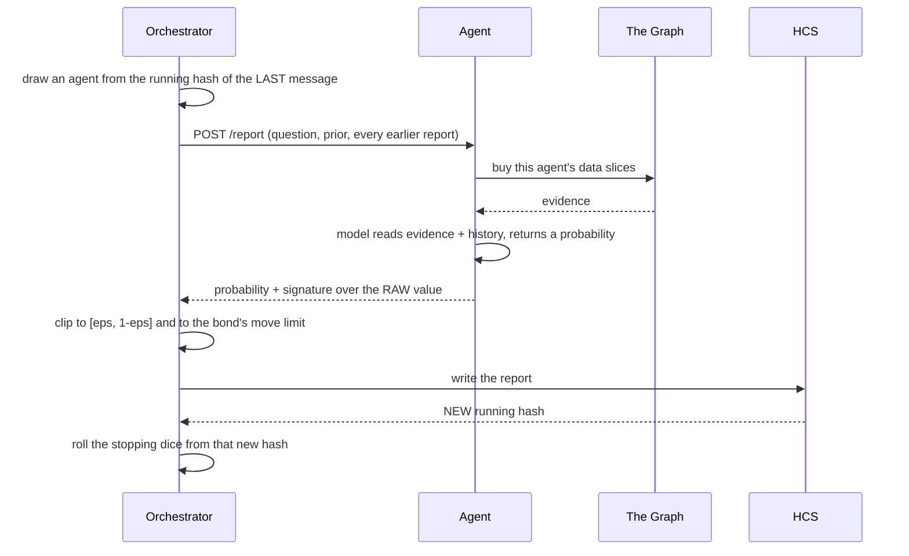

# Architecture

How a question becomes a price, and who gets paid for it.

## The shape of the system

```mermaid
flowchart TB
    asker([Asker]) -->|x402 payment on Hedera| api
    buyer([Buyer]) -->|"x402 payment, POST /resolve"| api

    subgraph api[API and orchestrator]
        routes[Routes: open, bond, register, resolve]
        orch[Orchestrator: draw, ask, write, roll]
        settle[Settlement: CE-MSR, invariants, transfer plan]
    end

    api -->|report + close + settlement messages| hcs[(Hedera HCS topic)]
    hcs -->|running hash| orch
    api -->|HBAR transfers| treasury[(Hedera treasury)]

    orch -->|"HTTP POST /report, deadline"| fleet

    subgraph fleet[Agent fleet, 20 separate processes]
        a1[agent-01 liquidity]
        a2[agent-02 holders]
        a3[agent-.. other subsets]
    end

    fleet -->|"paid GraphQL query"| graph[(The Graph Gateway)]
    fleet -->|"structured output"| llm[(LLM)]
```

Everything the mechanism decides is derived from the HCS topic. A third party
with the topic id and a public mirror node can recompute the draws, the
stopping point and the closing price without trusting this server.

## One round, and why the order cannot change



The roll has to come after the write. The hash it reads did not exist until the
network reached consensus on the report, which is the only reason nobody,
including the operator, could know where the market would stop.

A timeout is not a round. When an agent fails to answer, its bond is slashed
and it leaves the pool, but no dice are rolled. Otherwise any agent could close
a market early by going quiet.

## Money, and why it is a closed loop

Nothing enters from outside. The asker and the agents settle against each
other, and the settlement is computed once, at the end.

| In | Out |
| --- | --- |
| asker deposit `D` | scored payouts (may be negative) |
| `N` agent bonds | flat fee `R` to the last `k` agents |
| | bond returns |
| | asker refund |

Four rules hold, and three of them are enforced in code rather than documented:

1. `D >= b·H_max(prior) + k·R`. The deposit is the bound, computed by the same
   function that quotes the x402 price, so the price and the handler cannot
   disagree.
2. Total scored payout never exceeds `b·H(r, q0)`. The CE-MSR payments
   telescope, so only the opening and closing prices survive the sum. Asserted
   at settlement.
3. Money slashed from a negative score goes back to the asker, never to
   another agent. An agent's profit comes from the asker's fee, not from a
   rival's bond.
4. `in === out` to the tinybar. Published on the settlement endpoint as
   arithmetic rather than a green tick.

## Where each chain sits

| Layer | What it does | Why there |
| --- | --- | --- |
| Hedera testnet | deposits, bonds, settlement transfers | x402 payments and cheap finality |
| Hedera HCS | ordered report log, and the randomness | consensus timestamps give ordering that the operator cannot forge, and each message's running hash is unpredictable before consensus and verifiable after |
| The Graph | every agent's evidence | one standardized schema means one query shape works across protocols, which is what makes the comparative slice possible |
| Ethereum Sepolia | agent identity and reputation (ENSv2) | per-text-record permissions let an agent own its name and profile without being able to write its own score, see [ens-role-schema.md](./ens-role-schema.md) |

## The bond is a position limit, not an entry fee

With `eps = 0.01` a single agent's worst case is about `4.6b`, while the whole
market's subsidy is `b·log 2 ≈ 0.69b`. Sizing bonds for that worst case would
lock up roughly seven times the subsidy and nobody would join.

So the bond buys room to move instead. An agent may move the price as far as
its bond can carry, and the protocol clips the report to that range on arrival.
Clipping the loss later, at settlement, would break the telescoping sum and
with it the asker's cost guarantee, so the limit is applied at the source.

## The five data slices

Each agent gets a distinct subset of five slices, and each slice computes a
different statistic from a different part of the chain.

| Slice | Reads |
| --- | --- |
| liquidity | pool depth, TVL concentration, turnover against fees |
| holders | depositor concentration, addresses that arrive once and never return |
| activity | inter-arrival regularity, self-trading, repeated senders |
| bridge | cross-chain inflow and outflow, route concentration |
| comparative | percentile rank against peers on the same standardized schema |

This is not decoration. The paper's Assumption 4 requires agent signals to be
conditionally independent given the outcome; twenty agents reading the same
rows would be one agent with twenty votes. A test walks every pair of slices
and fails by name if two produce the same signal key, and a second test refuses
a pool in which two agents hold the same subset.

We do not claim Assumption 4 holds. Distinct subsets of five slices still share
underlying rows. The claim is that the pool is built to approach it.
